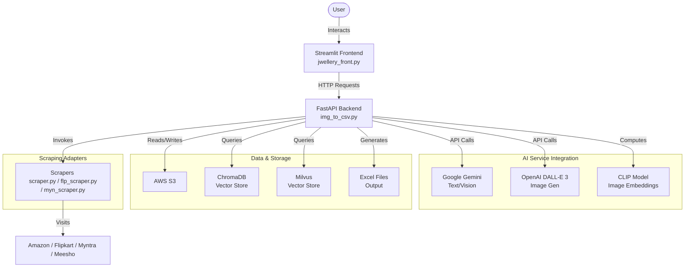
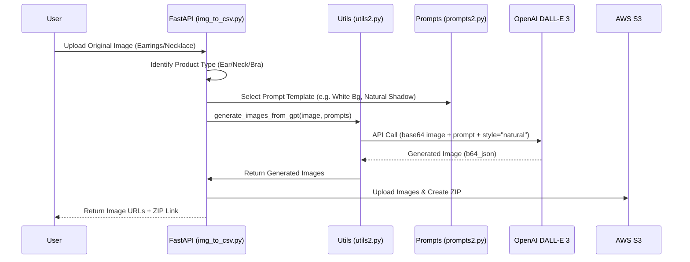
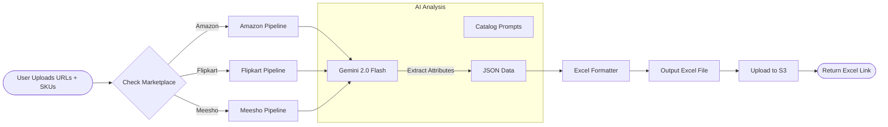
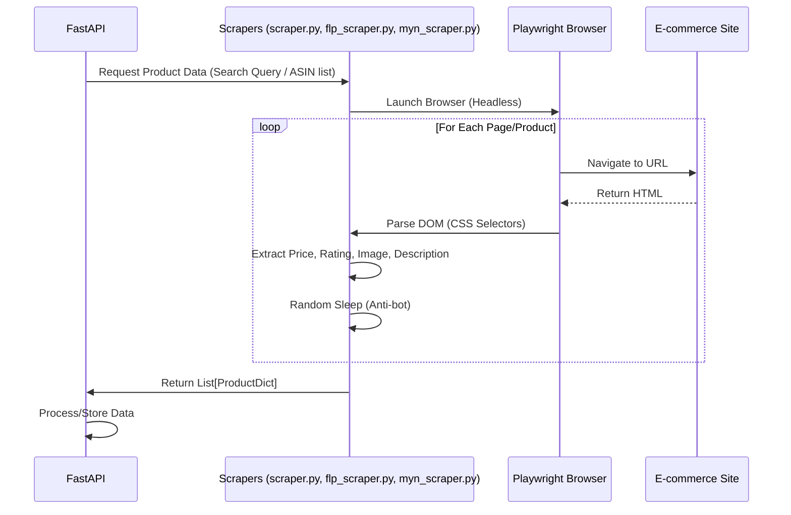

# Project Flow Diagrams

This document visualizes the different workflows within the AI Jewelry Assistant project.

## 1. High-Level Architecture

This diagram shows the main components of the system and how they interact.

## 2. Image Generation Workflow

This flow details how an uploaded product image is transformed into a marketing asset.

## 3. Catalog Automation Workflow

This flow shows how images are converted into e-commerce catalog spreadsheets.

## 4. Scraping Workflow

This flow illustrates how the system gathers data from external e-commerce sites.

